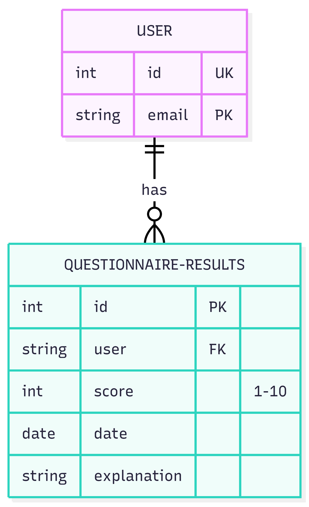

# HvanA Barometer

Een barometer voor de HvanA-website waarmee studenten kunnen aangeven hoe zij hun dag op de HvA hebben ervaren.

## Inhoudsopgave

- [Live link](#live-link)
- [Installatie instructies](#installatie-instructies)
- [Beschrijving van de site](#beschrijving-van-de-site)
- [Ontwerp](#ontwerp)
- [Gebruik van de site](#gebruik-van-de-site)
- [Bronnen](#bronnen)
- [Designkeuzes](#designkeuzes)
- [Datamodel](#datamodel)
- [Code conventies](#code-conventies)
- [Contributing](#contributing)

## Live link

[Bekijk de livesite](https://havanabarometer.netlify.app/)

## Installatie instructies

Het project is gemaakt met [SvelteKit](https://svelte.dev/docs/kit).

1. Clone de repository en ga naar de `dev` branch:

```sh
   git clone https://github.com/fdnd-agency/hvanabarometer.git
   cd hvanabarometer
   git checkout dev
```

2. Installeer de dependencies:

```sh
   npm install
```

3. Start de development server:

```sh
   npm run dev

   # of start de server en open de site meteen in een nieuw tabblad
   npm run dev -- --open
```

4. Open de site via de link die in de terminal verschijnt, meestal `http://localhost:5173`.

Een productieversie maken en bekijken:

```sh
npm run build
npm run preview
```

## Beschrijving van de site

De HvanA-website heeft nog geen barometer. In dit project voegen we die toe. Daarvoor hebben we de hele homepage nagebouwd, zodat de barometer in de bestaande opzet past.

Studenten kunnen met de barometer aangeven hoe zij hun dag op de HvA hebben ervaren. Ze kiezen een cijfer van 1 tot en met 10 en geven in een kort tekstveld een toelichting. Ze vullen ook hun HvA-e-mailadres in (verplicht), zodat de inzending aan een gebruiker gekoppeld kan worden. Daarna versturen ze de barometer met de knop "Verzend".

De site bestaat uit:

- De nagebouwde homepage van HvanA
- Een barometer header met het gemiddelde cijfer, het aantal stemmen en een knop om te stemmen
- De HvA-meter als `<dialog>` met cijferkeuze, toelichting, e-mailadres en een verzendknop
- Een detailpagina met een hero en alle uitslagen
- Een styleguide met kleuren, fonts en spacing

## Ontwerp

Het ontwerp staat in [Figma](https://www.figma.com/design/9FWic2H39qxzVw1M8mHraP/HavanA?node-id=17-2&t=ZxF1eIDh1nTqIRmE-0).


## Gebruik van de site

Een cijfer geven:

1. Klik in de blauwe barometer-balk op "Stem".
2. Kies een cijfer van 1 tot en met 10.
3. Vul een korte toelichting in.
4. Vul je HvA-e-mailadres in. Dit is verplicht.
5. Klik op "Verzend".
6. Sluit de dialog met "Terug" of met de Esc-toets.

Uitslagen bekijken:

Klik in de barometer-balk op het aantal stemmen. Je komt dan op de detailpagina met het gemiddelde cijfer en alle uitslagen.

## Bronnen

- [MDN: dialog](https://developer.mozilla.org/en-US/docs/Web/HTML/Reference/Elements/dialog)
- [MDN: fieldset](https://developer.mozilla.org/en-US/docs/Web/HTML/Reference/Elements/fieldset)
- [Formgent: types of forms](https://formgent.com/types-of-forms/)
- [SvelteKit documentatie](https://svelte.dev/docs/kit)
- [HvanA](https://hvana.nl): lettertype en logo komen van de bestaande website


## Designkeuzes

- **Dialog in plaats van pop-up:** we gebruiken het HTML-element `<dialog>`, omdat dat beter is voor de toegankelijkheid. De browser regelt het openen en sluiten, de focus blijft in de dialog en de Esc-toets sluit hem.
- **Styleguide:** kleuren, fonts, spacing en tekstgroottes staan als CSS-variabelen in de styleguide, zodat de hele site hetzelfde oogt.
- **Components:** de site is opgebouwd uit kleine, herbruikbare Svelte-components.
- **Kleur en font:** blauw is de primaire kleur. Koppen gebruiken het U8-font van HvanA en lopende tekst gebruikt Georgia.
- **Ontwerp:** gebaseerd op de Figma-ontwerpen.

## Datamodel

Het datamodel laat zien welke gegevens we opslaan en hoe ze aan elkaar gekoppeld zijn. We slaan het HvA-e-mailadres, het cijfer, de toelichting en de datum op.



## Code conventies

We commiten altijd met een prefix, zoals `feat:`, `fix:`, `style:` of `refactor:`.

Voorbeeld: `feat: add barometer hero component`

Onze code conventies staan in de [CONTRIBUTING.MD](https://github.com/fdnd-agency/hvanabarometer/blob/dev/CONTRIBUTING.MD).


## Contributing

Voor de werkwijze en alle regels, zie [CONTRIBUTING.MD](https://github.com/fdnd-agency/hvanabarometer/blob/dev/CONTRIBUTING.MD).